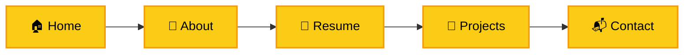

<div align="center">

# 🚀 Professional Portfolio

### A Premium, High-Performance Portfolio Experience

[](https://emredursun.nl)
[](LICENSE)

**Built with React · TypeScript · Tailwind CSS**

[Features](#-features) • [Tech Stack](#-tech-stack) • [Quick Start](#-quick-start) • [Performance](#-performance) • [License](#-license)

---

</div>

## 🎯 Overview

A meticulously crafted, **production-ready portfolio** designed to showcase professional work with stunning visual aesthetics and seamless user experience. Built with modern web technologies and optimized for performance, accessibility, and SEO.

> **Perfect for:** Developers, Designers, Engineers, and Creative Professionals seeking a premium online presence.

<br/>

## ✨ Features

<table>
<tr>
<td width="50%">

### 🎨 **Design Excellence**

- **Dual Theme System** — Elegant light & dark modes with smooth transitions
- **Premium Animations** — Micro-interactions and fluid motion design
- **Glassmorphism UI** — Modern, depth-rich interface elements
- **Responsive Layout** — Flawless across all devices and screen sizes

</td>
<td width="50%">

### ⚡ **Performance First**

- **Optimized Bundle** — Fast load times with code splitting
- **SEO Ready** — Structured data, meta tags, and sitemap
- **Accessibility** — WCAG compliant with semantic HTML
- **PWA Support** — Installable with offline capabilities

</td>
</tr>
</table>

### 🔥 **Interactive Sections**



- **Dynamic Project Filtering** — Real-time category-based filtering with smooth animations
- **Interactive Resume Timeline** — Visually engaging experience and education showcase
- **Smart Contact Form** — Integrated with modern validation and feedback
- **Theme Persistence** — Remembers user preferences across sessions

<br/>

## 🛠 Tech Stack

<div align="center">

|    Category    | Technologies                                                                                                                                                                                                                   |
| :------------: | :----------------------------------------------------------------------------------------------------------------------------------------------------------------------------------------------------------------------------- |
|  **Frontend**  |      |
|  **Styling**   |   |
| **Build Tool** |                                                                                                                              |
|   **Icons**    |                                                                                                        |
|   **Fonts**    |                                                                                               |

</div>

### 🎯 **Architecture Highlights**

- **Component-Based Architecture** — Modular, reusable, and maintainable
- **Type-Safe Development** — Full TypeScript coverage for reliability
- **Modern React Patterns** — Hooks, Context API, and functional components
- **Optimized Asset Loading** — Lazy loading and code splitting strategies

<br/>

## 🚀 Quick Start

### Prerequisites

> [!IMPORTANT]
> Ensure you have **Node.js 18.x or higher** installed on your system.

```bash
node --version  # Should be v18.x or higher
```

### Installation

```bash
# 1️⃣ Clone the repository
git clone https://github.com/emredursun/professional-portfolio.git
cd professional-portfolio

# 2️⃣ Install dependencies
npm install

# 3️⃣ (Optional) Configure environment variables
# Create .env.local file for API keys if needed
echo 'GEMINI_API_KEY="your_api_key_here"' > .env.local

# 4️⃣ Start development server
npm run dev
```

> [!TIP]
> The dev server will automatically open at `http://localhost:5173` with hot module replacement enabled.

### Available Scripts

| Command           | Description                       |
| ----------------- | --------------------------------- |
| `npm run dev`     | Start development server with HMR |
| `npm run build`   | Create optimized production build |
| `npm run preview` | Preview production build locally  |

<br/>

## 📊 Performance

<div align="center">

### ⚡ **Lighthouse Scores**

|        Metric         | Score |
| :-------------------: | :---: |
|  🎯 **Performance**   |  95+  |
| ♿ **Accessibility**  |  100  |
| 🎨 **Best Practices** |  100  |
|      🔍 **SEO**       |  100  |

</div>

### 🎨 **Design Principles**

- **Mobile-First Approach** — Designed for mobile, enhanced for desktop
- **Progressive Enhancement** — Core functionality works everywhere
- **Consistent Spacing** — 8px grid system for visual harmony
- **Color Psychology** — Carefully curated palette for professional impact

<br/>

## 📁 Project Structure

```
professional-portfolio/
├── 📄 index.html          # Entry HTML with SEO meta tags
├── 📄 App.tsx             # Main application component
├── 📄 constants.tsx       # Portfolio data and configuration
├── 📁 components/         # Reusable React components
│   ├── Sidebar.tsx
│   ├── About.tsx
│   ├── Resume.tsx
│   ├── Projects.tsx
│   └── ...
├── 📁 public/             # Static assets
│   ├── favicon.ico
│   ├── site.webmanifest
│   └── robots.txt
└── 📄 vite.config.ts      # Vite configuration
```

<br/>

## 🎨 Customization

### **Update Portfolio Content**

Edit [`constants.tsx`](constants.tsx) to personalize:

```typescript
// Update your personal information
export const PERSONAL_INFO = {
  name: "Your Name",
  title: "Your Professional Title",
  // ... more fields
};

// Add your projects
export const PROJECTS = [
  {
    title: "Project Name",
    category: "Web Development",
    // ... project details
  },
];
```

### **Modify Theme Colors**

Customize the color scheme in [`index.html`](index.html):

```javascript
tailwind.config = {
  theme: {
    extend: {
      colors: {
        // Your custom colors here
      },
    },
  },
};
```

<br/>

## 🌐 Deployment

### **Recommended Platforms**

| Platform         | Best For                | Deploy Command                      |
| ---------------- | ----------------------- | ----------------------------------- |
| **Vercel**       | Zero-config React apps  | `vercel --prod`                     |
| **Netlify**      | Static sites with CI/CD | `netlify deploy --prod`             |
| **GitHub Pages** | Free hosting            | `npm run build && gh-pages -d dist` |

> [!NOTE]
> The project includes pre-configured `robots.txt`, `sitemap.xml`, and `site.webmanifest` for production deployment.

<br/>

## 🤝 Contributing

Contributions are welcome! Please feel free to submit a Pull Request.

1. Fork the repository
2. Create your feature branch (`git checkout -b feature/AmazingFeature`)
3. Commit your changes (`git commit -m 'Add some AmazingFeature'`)
4. Push to the branch (`git push origin feature/AmazingFeature`)
5. Open a Pull Request

<br/>

## 📄 License

This project is licensed under the **MIT License** - see the [LICENSE](LICENSE) file for details.

<br/>

## 🙏 Acknowledgments

- **Design Inspiration** — Modern portfolio trends and Awwwards winners
- **Icons** — [Font Awesome](https://fontawesome.com/)
- **Fonts** — [Google Fonts - Plus Jakarta Sans](https://fonts.google.com/specimen/Plus+Jakarta+Sans)
- **Framework** — [React](https://react.dev/) & [Vite](https://vitejs.dev/)

<br/>

---

<div align="center">

### 💫 **Built with passion by [Emre Dursun](https://emredursun.nl)**

[](https://www.linkedin.com/in/emre-dursun-nl)
[](https://github.com/emredursun)
[](https://emredursun.nl)

**⭐ Star this repo if you found it helpful!**

</div>
