<div align="center">

# 🚀 Professional Portfolio

### A Premium, High-Performance Portfolio Experience

[](https://emredursun.nl)
[](LICENSE)

**Built with React · TypeScript · Tailwind CSS · React-i18next**

[Features](#-features) • [Tech Stack](#-tech-stack) • [Quick Start](#-quick-start) • [Performance](#-performance) • [License](#-license)

---

</div>

## 🎯 Overview

A meticulously crafted, **production-ready portfolio** designed to showcase professional work with stunning visual aesthetics and seamless user experience. Built with modern web technologies and optimized for performance, accessibility, and SEO.

> **Perfect for:** Developers, Designers, Engineers, and Creative Professionals seeking a premium online presence.

<br/>

## ✨ Features

<table>
<tr>
<td width="50%">

### 🎨 **Design Excellence**

- **Dual Theme System** — Elegant light & dark modes with smooth transitions
- **GSAP Animations** — Professional parallax effects and smooth scrolling with Lenis
- **Cinematic Preloader** — Premium typographic loading experience with GSAP
- **Glassmorphism UI** — Modern, depth-rich interface elements
- **Responsive Layout** — Flawless across all devices and screen sizes

</td>
<td width="50%">

### ⚡ **Performance First**

- **Optimized Bundle** — Fast load times with code splitting
- **SEO Ready** — Structured data, meta tags, and sitemap
- **Accessibility** — WCAG compliant with semantic HTML
- **PWA Support** — Installable with offline capabilities
- **Multi-Language** — Native support for English, Turkish, and Dutch

</td>
</tr>
</table>

### 🔥 **Interactive Features**

```mermaid
graph LR
    A[🏠 Home] --> B[👤 About]
    B --> C[💼 Resume]
    C --> D[🎨 Projects]
    D --> E[📬 Contact]
    F[⌘K Command Palette] -.->|Quick Access| A
    F -.-> B
    F -.-> C
    F -.-> D
    F -.-> E

    style A fill:#facc15,stroke:#f59e0b,stroke-width:2px,color:#000
    style B fill:#facc15,stroke:#f59e0b,stroke-width:2px,color:#000
    style C fill:#facc15,stroke:#f59e0b,stroke-width:2px,color:#000
    style D fill:#facc15,stroke:#f59e0b,stroke-width:2px,color:#000
    style E fill:#facc15,stroke:#f59e0b,stroke-width:2px,color:#000
    style F fill:#06b6d4,stroke:#0891b2,stroke-width:2px,color:#000
```



#### 🎯 **Core Features**

- **Multi-Language Support** — Seamless switching between English, Turkish (Native), and Dutch (Intermediate), with automatic language detection and specialized tech terminology.
- **Configurable Status Badge** — Easily toggle between 'Open to Work', 'Freelance', 'Hiring', etc., via `constants.tsx`.
- **Command Palette (Cmd/Ctrl+K)** — Fuzzy search navigation with recent commands tracking.
- **Enhanced Project Modal** — Full-featured project showcase with gallery, sections, and navigation.
- **Smart Scroll-to-Top** — Intelligent button that works in both main page and modals.
- **Dynamic Project Filtering** — Real-time category and technology filtering with animations.
- **Interactive Resume Timeline** — Visually engaging experience and education showcase.
- **Smart Contact Form** — Integrated email service with validation and feedback.

#### 🎭 **Advanced Interactions**

- **Multi-layer Parallax** — Depth-rich scrolling with background and floating elements.
- **Progress Tracking** — Visual scroll progress ring on scroll-to-top button.
- **Keyboard Navigation** — Full keyboard shortcuts support (Cmd+K, Esc, Arrow keys).
- **Staggered Animations** — Smooth fade-in animations with delay for visual hierarchy.

<br/>

## 🛠 Tech Stack

<div align="center">

|    Category    | Technologies                                                                                                                                                                                                                   |
| :------------: | :----------------------------------------------------------------------------------------------------------------------------------------------------------------------------------------------------------------------------- |
|  **Frontend**  |      |
|  **Styling**   |   |
| **Animation**  |                                     |
|  **Localize**  |                                                                                                                    |
| **Build Tool** |                                                                                                                              |
|   **Search**   |                                                                                                                                          |
|   **Icons**    |                                                                                                        |
|   **Fonts**    |                                                                                               |

</div>

### 🎯 **Architecture Highlights**

- **Component-Based Architecture** — Modular, reusable, and maintainable
- **Type-Safe Development** — Full TypeScript coverage for reliability
- **Internationalization (i18n)** — Scalable translation infrastructure with namespace support
- **Modern React Patterns** — Hooks, Context API, and functional components
- **Optimized Asset Loading** — Lazy loading and code splitting strategies
- **GSAP Animations** — Professional-grade animations with ScrollTrigger

<br/>

## 🚀 Quick Start

### Prerequisites

> [!IMPORTANT]
> Ensure you have **Node.js 18.x or higher** installed on your system.

```bash
node --version  # Should be v18.x or higher
```

### Installation

```bash
# 1️⃣ Clone the repository
git clone https://github.com/emredursun/professional-portfolio.git
cd professional-portfolio

# 2️⃣ Install dependencies
npm install

# 3️⃣ (Optional) Configure environment variables
# Create .env.local file for API keys if needed
echo 'GEMINI_API_KEY="your_api_key_here"' > .env.local

# 4️⃣ Start development server
npm run dev
```

> [!TIP]
> The dev server will automatically open at `http://localhost:5173` with hot module replacement enabled.

### Available Scripts

| Command           | Description                       |
| ----------------- | --------------------------------- |
| `npm run dev`     | Start development server with HMR |
| `npm run build`   | Create optimized production build |
| `npm run preview` | Preview production build locally  |

<br/>

## 📊 Performance

<div align="center">

### ⚡ **Lighthouse Scores**

|        Metric         | Score |
| :-------------------: | :---: |
|  🎯 **Performance**   |  95+  |
| ♿ **Accessibility**  |  100  |
| 🎨 **Best Practices** |  100  |
|      🔍 **SEO**       |  100  |

</div>

### 🎨 **Design Principles**

- **Mobile-First Approach** — Designed for mobile, enhanced for desktop
- **Progressive Enhancement** — Core functionality works everywhere
- **Consistent Spacing** — 8px grid system for visual harmony
- **Color Psychology** — Carefully curated palette for professional impact

<br/>

## 📁 Project Structure

```
professional-portfolio/
├── 📄 index.html          # Entry HTML with SEO meta tags
├── 📄 App.tsx             # Main application with GSAP animations
├── 📄 constants.tsx       # Portfolio data and configuration
├── 📄 i18n.ts             # Internationalization config
├── 📄 types.ts            # TypeScript type definitions
├── 📁 components/         # Reusable React components
│   ├── Sidebar.tsx        # Navigation and profile
│   ├── LanguageSwitcher.tsx # i18n language toggle
│   ├── About.tsx          # About section with parallax
│   ├── Resume.tsx         # Experience timeline
│   ├── Projects.tsx       # Project grid with filtering
│   ├── Contact.tsx        # Contact form
│   ├── Navbar.tsx         # Mobile navigation
│   ├── Preloader.tsx      # Cinematic loading screen
│   ├── CommandPalette.tsx # Fuzzy search command palette
│   ├── ProjectModal.tsx   # Full-screen project details
│   ├── ProjectGallery.tsx # Image gallery component
│   ├── ProjectModalHeader.tsx # Modal header with gradient
│   ├── ProjectSectionNav.tsx  # Section navigation tabs
│   ├── ScrollToTopButton.tsx  # Smart scroll-to-top button
│   ├── SmoothScroll.tsx   # Lenis smooth scroll wrapper
│   └── hooks/
│       ├── useGSAP.tsx    # GSAP animation hook
│       └── useCommandPalette.tsx # Command palette logic
├── 📁 public/             # Static assets
│   ├── locales/           # Translation files (en, tr, nl)
│   ├── favicon.ico
│   ├── site.webmanifest
│   ├── robots.txt
│   └── sitemap.xml
└── 📄 vite.config.ts      # Vite configuration
```

<br/>

## ⌨️ Keyboard Shortcuts

Enhance your browsing experience with these keyboard shortcuts:

| Shortcut             | Action                          |
| -------------------- | ------------------------------- |
| `Cmd/Ctrl + K`       | Open Command Palette            |
| `Esc`                | Close modals or Command Palette |
| `←` `→` (in modal)   | Navigate between projects       |
| `↑` `↓` (in palette) | Navigate through search results |
| `Enter` (in palette) | Execute selected command        |

> [!TIP]
> Use the **Command Palette** for lightning-fast navigation! Press `Cmd/Ctrl + K` and start typing to jump to any page, switch themes, language, or filter projects.

<br/>

## 🎨 Customization

### **Update Portfolio Content**

Edit [`constants.tsx`](constants.tsx) to personalize:

```typescript
// Update your personal information
export const PERSONAL_INFO = {
  name: "Your Name",
  title: "Your Professional Title",
  // ... more fields
};

// Configure Status Badge
export const STATUS_BADGE = {
  enabled: true,
  type: "openToWork", // or 'freelance', 'hiring', 'busy'
  // ...
};
```

### **Modify Theme Colors**

Customize the color scheme in [`index.html`](index.html):

```javascript
tailwind.config = {
  theme: {
    extend: {
      colors: {
        // Your custom colors here
      },
    },
  },
};
```

### **Add Translations**

Add new languages or update existing ones in `public/locales/{lang}/{namespace}.json`.

<br/>

## 🌐 Deployment

### **Firebase Hosting (Current)**

This portfolio is deployed on **Firebase Hosting** with Google Analytics integration.

**Live Site:** [https://emredursun-portfolio.web.app](https://emredursun-portfolio.web.app)

#### Deploy Your Own

```bash
# Install Firebase CLI
npm install -g firebase-tools

# Login to Firebase
firebase login

# Deploy to production
npm run build
firebase deploy
```

#### Features Included

- ✅ **Security Headers** — X-Frame-Options, Content-Security-Policy, etc.
- ✅ **SSL/HTTPS** — Automatic certificate provisioning
- ✅ **Global CDN** — Fast delivery worldwide
- ✅ **Google Analytics** — Integrated tracking
- ✅ **SPA Routing** — All routes handled correctly
- ✅ **Optimized Caching** — Static assets cached for 1 year
- ✅ **i18n Routing** — URL-based language routing (e.g., /tr, /nl)
- ✅ **Hreflang SEO** — Proper `hreflang` tags for international search visibility

> [!TIP]
> Configuration files included: `firebase.json`, `.firebaserc`, `robots.txt`, `sitemap.xml`, and `site.webmanifest`

<br/>

## 🤝 Contributing

Contributions are welcome! Please feel free to submit a Pull Request.

1. Fork the repository
2. Create your feature branch (`git checkout -b feature/AmazingFeature`)
3. Commit your changes (`git commit -m 'Add some AmazingFeature'`)
4. Push to the branch (`git push origin feature/AmazingFeature`)
5. Open a Pull Request

<br/>

## 📄 License

This project is licensed under the **MIT License** - see the [LICENSE](LICENSE) file for details.

<br/>

## 🙏 Acknowledgments

- **Design Inspiration** — Modern portfolio trends and Awwwards winners
- **Icons** — [Font Awesome](https://fontawesome.com/)
- **Fonts** — [Google Fonts - Plus Jakarta Sans](https://fonts.google.com/specimen/Plus+Jakarta+Sans)
- **Framework** — [React](https://react.dev/) & [Vite](https://vitejs.dev/)

<br/>

---

<div align="center">

### 💫 **Built with passion by [Emre Dursun](https://emredursun.nl)**

[](https://www.linkedin.com/in/emre-dursun-nl)
[](https://github.com/emredursun)
[](https://emredursun.nl)

**⭐ Star this repo if you found it helpful!**

</div>
